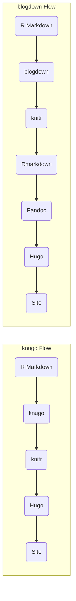

# knugo

**A minimal R package for integrating knitr output directly into a Hugo-based
site.** The goal of _knugo_ is to keep the workflow “Hugo-centric,” while
ensuring that R code, plots, and htmlwidgets can be rendered seamlessly and
included in Hugo posts or pages—without needing **blogdown**, **rmarkdown**, or
other heavier layers like **Quarto**.

## Why knugo?

- **Lightweight:** Just enough code to handle knitting R code and managing
  htmlwidget dependencies.
- **Hugo-Centric:** Allows you to leverage all of Hugo’s built-in features
  (shortcodes, layouts, archetypes) without additional rmarkdown/pandoc layers.
- **Familiar:** Under the hood, it still relies on **knitr**, so code chunks,
  figures, and tables behave as you’d expect in an R Markdown-like environment.
- **Flexible:** You control when and how `.Rmd` files are knit, and how their
  output is merged into your Hugo `content/` directory.

## How It Works

1. **knitr Wrapper**
   - A minimal function that sets up `knitr::opts_chunk` and optionally
     overrides certain knitr hooks so your code, figures, and tables are
     correctly rendered for Hugo.
   - Produces either `.md` or standalone `.html` fragments.

2. **htmlwidget Support**
   - A custom `knit_print()` method detects `htmlwidget` objects (e.g.,
     `leaflet`, `plotly`, `DT`) and ensures they are emitted as functional HTML
     snippets.

3. **Dependency Management**
   - Collects and places JS/CSS files for htmlwidgets in a designated
     Hugo-friendly location (e.g., `static/libs/`).
   - Ensures the knitted output references those libraries correctly, so
     widgets render in the final site.

### Comparing knugo, blogdown, and Quarto

#### High-Level Diagram



- **knugo**:
  1. You manually knit or run a small `build_site()` function that calls
     **knitr**.
  2. knugo moves (and/or references) the generated files in `content/` and
     places dependencies in `static/`.
  3. You run `hugo`, which builds the final static site.

- **blogdown**:
  1. It automatically uses knitr/rmarkdown behind the scenes.
  2. It manages front matter, shortcodes, widget dependencies, and triggers
     Hugo builds—more tooling, less manual control.

- **Quarto**:
  1. Quarto can produce complete websites by itself or integrate with other
     static site generators.
  2. Typically, though, it bypasses Hugo or reuses some aspects of it.
  3. Heavier than a direct knitr approach but has many advanced features
     (cross-references, citations, etc.).

## Project Roadmap

1. [X] **Knitr Wrapper**
   - [X] Configure knitr to produce `.md`
   - [X] Call knitr render method
   - [X] Test that generate:
     - [X] SVG file from a plot
     - [X] Kable table

2. [ ] **HTML Widget Integration**
   - [ ] Add a `knit_print()` method for `htmlwidget` objects.
   - [ ] Proof: a widget like **plotly** or **leaflet** is included as a proper
     HTML snippet in the knitted output.

3. **Dependency Management**
   - [ ] Extract JS/CSS dependencies (e.g., from
     `htmlwidgets::getDependency()`) and place them in Hugo’s `static/` folder
     (or a subdirectory).
   - [ ] Update references in the knitted output so the widget works.
   - [ ] Proof: the widget renders without any missing script or stylesheet errors.

4. **Workflow Automation** (Future)
   - [ ] Optionally add a `build_site()` function or script that:
     - [ ] Finds all relevant R/`.Rmd` files,
     - [ ] Knits them,
     - [ ] Copies output to `content/`,
     - [ ] Calls `hugo`.

## Example Usage (Hypothetical)

```r
# install.packages("remotes")
# remotes::install_github("yourusername/knugo")

library(knugo)

# Hypothetical usage:
knugo::knugo_render("my-post.Rmd", output = "content/posts/my-post.md")
# This:
# 1. Knits my-post.Rmd
# 2. Writes the final .md file to content/posts/my-post.md
# 3. Manages any htmlwidget dependencies in static/libs or similar
```

Then run:
```bash
hugo
```
to build the final site.

## FAQ

1. **Do I need to handle front matter in `.Rmd`?**
   - Not necessarily. You can rely on Hugo’s archetypes or manually insert front matter in your knitted result.

2. **Can I embed Hugo shortcodes?**
   - Yes. knitr generally passes unescaped Markdown or HTML through. As long as you don’t accidentally interpret shortcodes as code, they should work fine.

3. **Does knugo replace blogdown or Quarto?**
   - Not for everyone. blogdown and Quarto provide more functionality and convenience. knugo is for those who want a minimal pipeline that remains tightly Hugo-centric and who don’t mind manually managing some details.

## Contributing

- **Issues & Ideas**: Please open an issue if you have problems or suggestions for improvements.
- **Pull Requests**: Contributions are welcome, especially for additional widget types or improved CLI tooling.

---

Enjoy a fully **Hugo-centric** yet **R-capable** blogging workflow with **knugo**!

